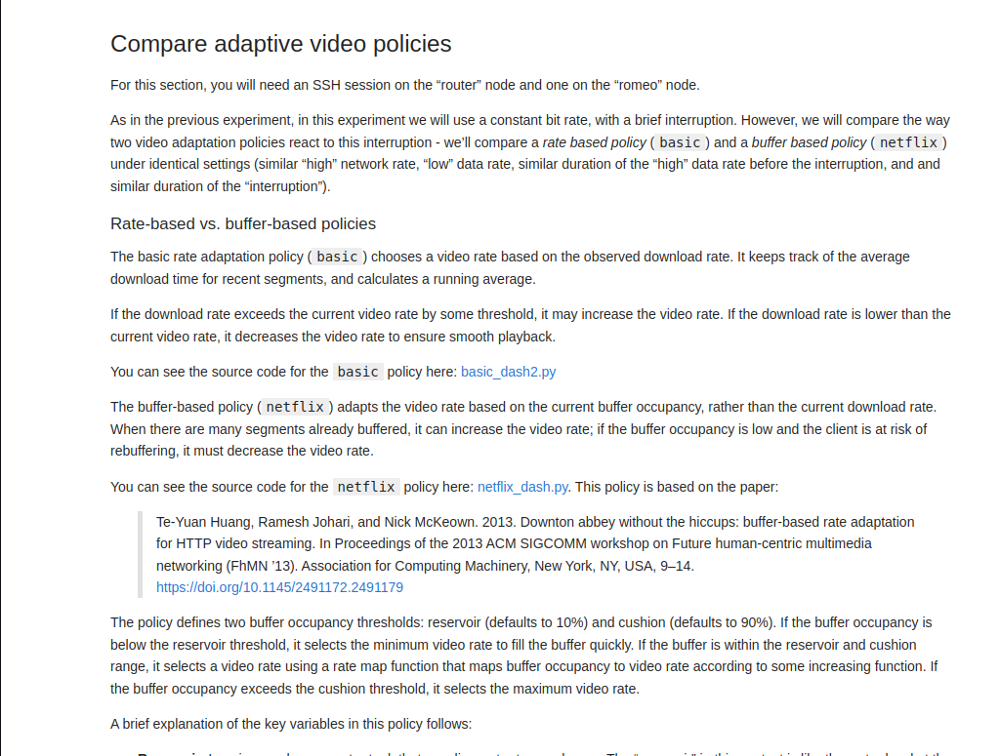

Hello Again!

I'm excited to present my final blog post summarizing the progress and achievements made over the 2023 Summer of Reproducibility Fellowship.I will be sharing the work I've created for the [Teaching Computer Networks with Reproducible Research: Developing a 'classroom competition' for adaptive video delivery](/project/osre23/nyu/edunet).

## Recap of the Journey

In my [mid-term](content/report/osre23/nyu/edunet/20230801-Srishti-j18) evaluation, I discussed the initial milestones and challenges I encountered during this program. At that point, I studied the key figures from the research paper '[Downton Abbey Without the Hiccups: Buffer-Based Rate Adaptation for HTTP Video Streaming](https://dl.acm.org/doi/10.1145/2491172.2491179)'. My primary objectives were to ensure compatibility with both Python 2 and Python 3 and to incorporate an 'Estimated Download Rate' metric into the output file generated by the adaptive video client. Furthermore, I expanded the project to include two crucial visualizations: buffer occupancy vs. time and estimated download rate vs. time.

## Final Project Progress

In the final weeks of my internship, I worked towards my ultimate goal, which was to reproduce existing work and create a clear guide for future students. I aimed to enable them to build upon and improve this work. To achieve this, I created a new experiment using an existing one, 

which I titled "[Compare Adaptive Video Policies](https://github.com/Srishti-j18/adaptive-video/blob/68bd537a65eeec0f221ae095b35b18c1e8ffd2ef//notebooks/exec_policy.ipynb)"

This experiment compares two policies: rate-based (basic) policy and 
buffer-based (Netflix) policy. In the experiment, I covered the following key aspects:

How Both Policies Work: I detailed the workings of both the rate-based and buffer-based policies, explaining how each policy selects the next bitrate, among other relevant information.

Instructions for Execution of Policies: After conducting several experiments with different settings, I determined the most appropriate settings for this experiment. These settings have been added to the instructions for executing both policies, with a focus on ensuring similar "high" network rates, "low" data rates, similar durations of the "high" data rate before the 
interruption, and similar durations of the "interruption." This setup allows for an easy and clear comparison of the two policies.

Discussion Part: In the discussion section, I addressed the differences that students can observe after conducting the experiment and visualising the graphs and videos.

In conclusion, I would like to thank my mentor, {}, who has given me excellent guidance and would like to express my gratitude to OSRE23, where I have learned so much. This experience has been amazing for my personal and professional growth.
